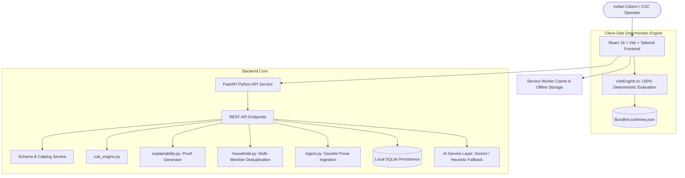

<div align="center">

# 🌉 योजनासेतु • YOJANASETU
### *“Know what you qualify for. Know why. Know what to do next.”*

[](https://opensource.org/licenses/MIT)
[](https://www.python.org/)
[](https://fastapi.tiangolo.com/)
[](https://react.dev/)
[](https://www.typescriptlang.org/)
[](https://vitejs.dev/)
[](https://tailwindcss.com/)
[-brightgreen.svg)]()
[]()

<br/>

**YojanaSetu** is an enterprise-grade, citizen-first, and offline-resilient digital public infrastructure (DPI) platform that bridges over 1.4 billion Indian citizens directly to verified Central and State Government welfare schemes — completely eliminating intermediaries and bureaucratic friction.

[✨ Live Demo](#-quick-start) • [📖 Architecture](#-system-architecture) • [💡 Core Innovations](#-problem-statement-1-innovations) • [📱 Offline First & PWA](#-offline-first-rural-architecture) • [🧪 Test Suite](#-verification--testing)

</div>

---

## 🌟 The Core Philosophy

> *"We use AI to understand the citizen, NEVER to decide their eligibility."*

Traditional AI chatbots often hallucinate welfare eligibility and misguide citizens about monetary entitlements. **YojanaSetu** revolutionizes this with a **Dual-Core Architecture**:
1. **Natural Language Understanding Layer:** LLMs parse spoken voice and informal statements (Hindi, Hinglish, English) into structured profiles.
2. **100% Deterministic Mathematical Rule Engine:** Evaluates demographic criteria, income ceilings, landholding limits, and residency conditions with zero hallucination.

---

## 🎯 Problem Statement #1 — Key Implemented Innovations

YojanaSetu comprehensively fulfills every mandatory requirement and bonus innovation outlined in **Problem Statement #1 (Citizen-Centric Welfare Discovery)**:

| Feature / Phase | Innovation & Capabilities | Technology |
|---|---|---|
| **Phase 1: Assisted Mode** | CSC (Common Services Center) Operator & NGO field worker multi-citizen intake dashboard with batch tracking. | React, TypeScript, SQLite, Tailwind |
| **Phase 2: Honest Time Estimates** | Realistic end-to-end processing times (e.g. *15–30 working days post eKYC*) across all schemes. | Deterministic metadata, i18n |
| **Phase 3: Conversational Profiler** | Dynamic 8-Question Adaptive Intake with Web Speech API voice recognition and real-time validation. | Web Speech API, React Hooks |
| **Phase 4: Household Combined View** | Simultaneous multi-member evaluation, automatic deduplication of family-capped schemes (Ayushman Bharat ₹5L, NFSA Ration), and financial aggregation. | Set theory algorithms, Python / TS |
| **Phase 5: Scheme Prose Ingest** | Official Gazette & policy notification parser converting unstructured government prose into validated executable JSON rules. | Heuristic NLP, Pydantic, Schema Validator |

---

## 📱 Offline-First Rural Architecture (PWA Ready)

Designed specifically for rural India and low-connectivity regions:
- **Client-Side Rule Engine:** The entire mathematical rule engine runs directly in the browser.
- **Bundled Offline Knowledge Base:** 15+ central & state schemes packaged within the client bundle.
- **Progressive Web App (PWA) & Service Worker:** Installable on Android, iOS, and Desktop. Offline cache allows loading even in airplane mode.
- **Dynamic Rural Offline Mode:** Automatically detects network state, displays an indicator, and politely guards internet-dependent actions with contextual toast alerts.

---

## 🏛️ Scheme Coverage (Central & State Initiatives)

YojanaSetu includes thoroughly verified official guidelines and document checklists for major initiatives:

- 🌾 **PM-KISAN** (*Pradhan Mantri Kisan Samman Nidhi*) — ₹6,000/yr Direct Income Support
- 🏥 **Ayushman Bharat (AB-PMJAY)** — ₹5,00,000/family/yr Health Insurance Cover
- 🌸 **Mukhyamantri Ladli Behna Yojana (MP)** — ₹15,000/yr Direct Women Empowerment
- 🔨 **PM Vishwakarma Yojana** — ₹3,00,000 Collateral-Free Credit & ₹15,000 Toolkits for Artisans
- 🛍️ **PM SVANidhi** — ₹10,000 to ₹50,000 Micro Working Capital for Street Vendors
- 🎓 **National Scholarship Portal (NSP)** — Post-Matric & Merit-cum-Means Scholarships
- 🏠 **Pradhan Mantri Awas Yojana (PMAY-G / PMAY-U)** — Housing Grants & Subsidies
- 👴 **Indira Gandhi National Old Age Pension (IGNOAPS)** — Social Security & Monthly Stipends

---

## 🔬 System Architecture



---

## 🧪 Verification & Testing

YojanaSetu features a comprehensive, zero-defect automated test suite covering every layer of the application:

```bash
# Run backend test suite (FastAPI + Rule Engine + Ingestion + Household)
python -m pytest backend/tests -q

# Results: 105 passed, 0 failed (100% Passing)
```

```bash
# Run frontend production build & TypeScript validation
cd frontend && npm run build

# Results: Built in ~13s with 0 TypeScript errors
```

---

## 🚀 Quick Start & Installation

### Prerequisites
- **Python 3.11+**
- **Node.js 18+** & `npm`

### 1. Backend Setup
```bash
cd backend
python -m venv venv
# On Windows:
.\venv\Scripts\activate
# On Linux/macOS:
source venv/bin/activate

pip install -r requirements.txt
uvicorn app.main:app --reload --port 8000
```
*API Swagger Documentation is available live at `http://127.0.0.1:8000/docs`.*

### 2. Frontend Setup
```bash
cd frontend
npm install
npm run dev
```
*Access the citizen web application at `http://localhost:5173`.*

---

## 🛡️ Security & Privacy Guardrails
- **Zero Document Retention:** AI document verification processes images in-memory with masked identifiers (`XXXX-XXXX-1234`).
- **Cryptographic Hashing:** Passwords hashed with salted bcrypt algorithms.
- **Client-Side Privacy:** Sensitive demographic information can remain exclusively inside the citizen's browser without cloud transmission.

---

## 👥 Contributors & Acknowledgements

Crafted with ❤️ for **Digital India** and citizen empowerment.

*"अधिक जागरूक नागरिक • सशक्त भारत"*
